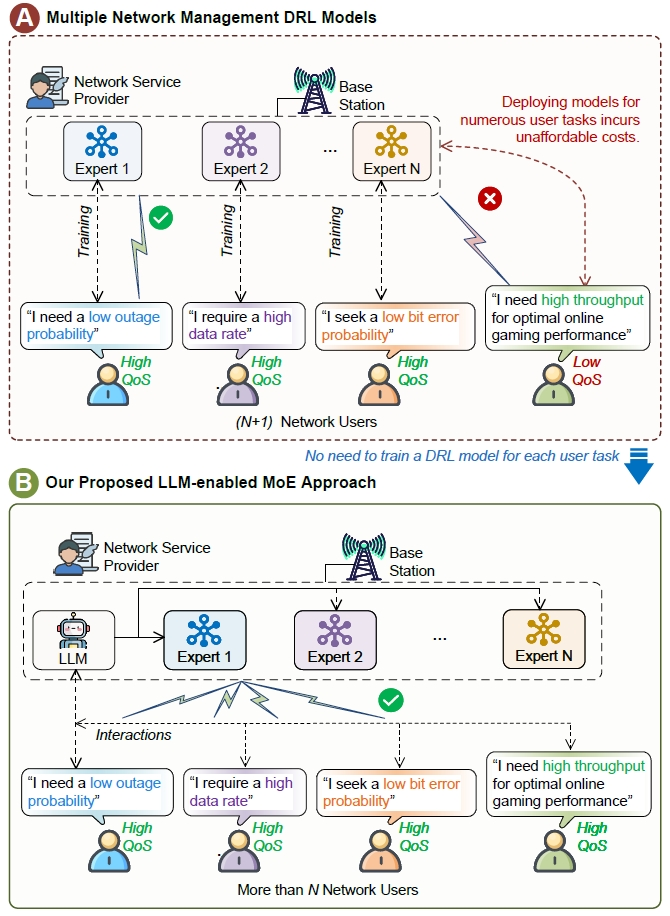
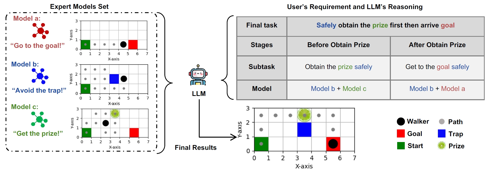
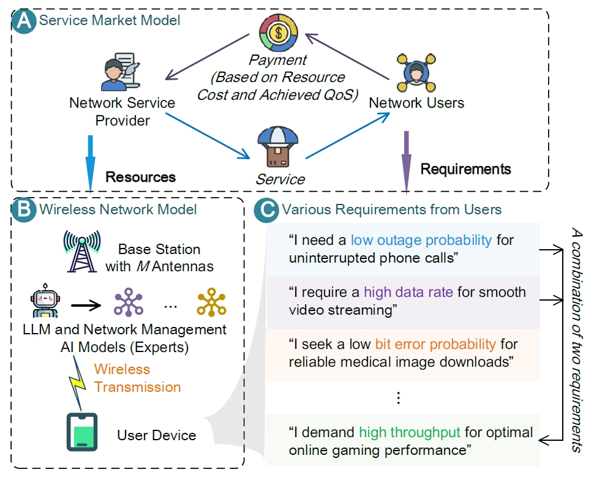

# [MoE4OPT Project](https://hongyangdu.github.io/MoE4OPT/)

This repository contains a demo implementation of the algorithm as presented in:

> **"Mixture of Experts for Network Optimization: A Large Language Model-enabled Approach" [Download Paper](https://arxiv.org/pdf/2402.09756.pdf)**


Network optimization strategies. *Part A* demonstrates the drawbacks of training distinct AI models for different user requirements, emphasizing the costs of excessive AI model deployment. *Part B* presents our LLM-enabled MoE approach, using a limited set of DRL models to efficiently address a variety of user tasks.


The problem we solve: *How can we achieve effective network optimization without using numerous DRL models individually trained for each specific task?*


---

## 🔧 Environment Setup

To create a new conda environment, execute the following command:

```bash
conda create --name moeopt python==3.7
```
## ⚡Activate Environment

Activate the created environment with:

```bash
conda activate moeopt
```

## 📦 Install Required Packages

The following packages can be installed using pip:

```bash
pip install torch
pip install opencv-python==4.1.2.30
pip install scipy
pip install torchvision
pip install scikit-image
```

## 🏃‍♀️ Run the Program

Run `main.py` to start the program.


## 🔍 Case Study 1: Maze Navigation Task
LLM-enabled MoE framework demonstration in a maze navigation task. An ensemble of DRL models trained on diverse tasks serves as a set of
expert models accessible to the LLM. The LLM analyzes and infers user tasks, leveraging combinations of expert models to address the final objectives.



## 🔍 Case Study 2: Service Provider Utility Maximization Problem
System model. *Part A* shows the Service Market Model, illustrating the interaction between the NSPs and Users. *Part B* represents the Wireless Network Model, wherein we consider a BS with M antennas providing services to a user device. *Part C* shows various user requirements under different scenarios, which affect the payment structure in Part A and the optimal power allocation strategies in Part B.




## 📚 Cite Our Work

Should our code assist in your research, please acknowledge our work by citing:

```bibtex
@article{du2024mixture,
  title={Mixture of Experts for Network Optimization: A Large Language Model-enabled Approach},
  author={Du, Hongyang and Liu, Guangyuan and Lin, Yijing and Niyato, Dusit and Kang, Jiawen and Xiong, Zehui and Kim, Dong In},
  journal={arXiv preprint arXiv:2402.09756},
  year={2024},
  month = {Feb.}
}
```
